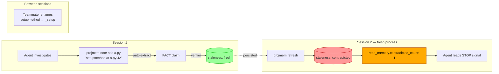
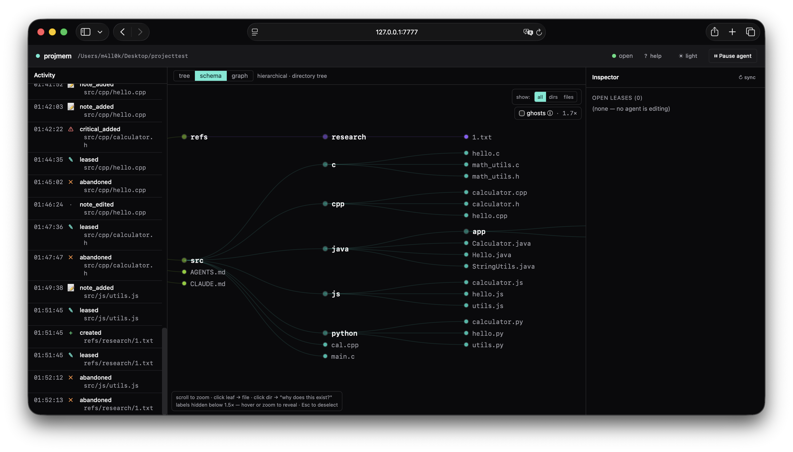
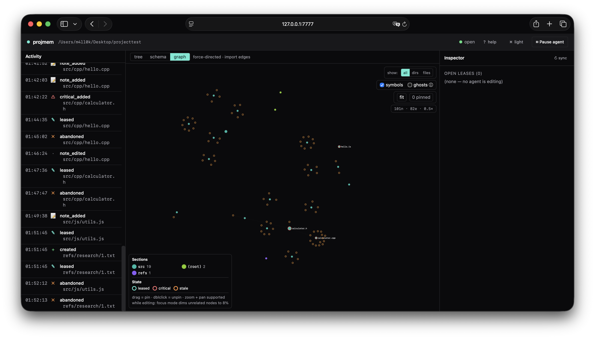
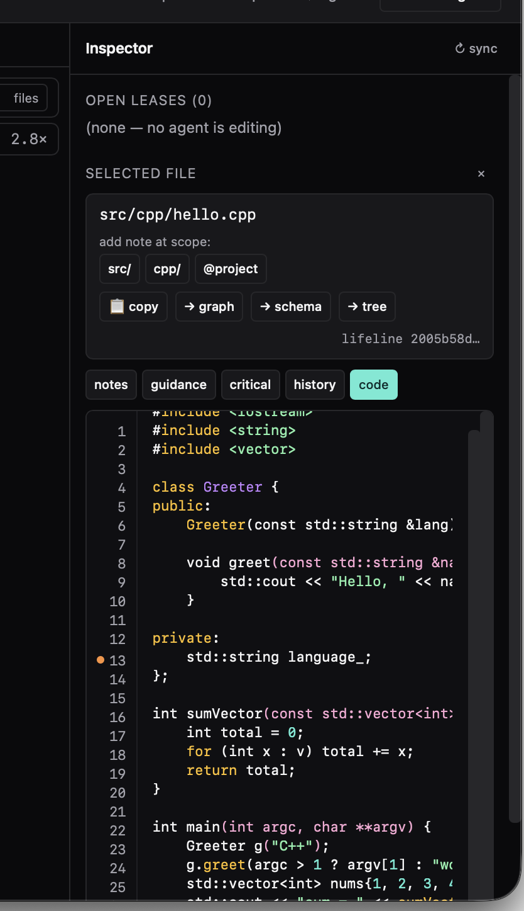
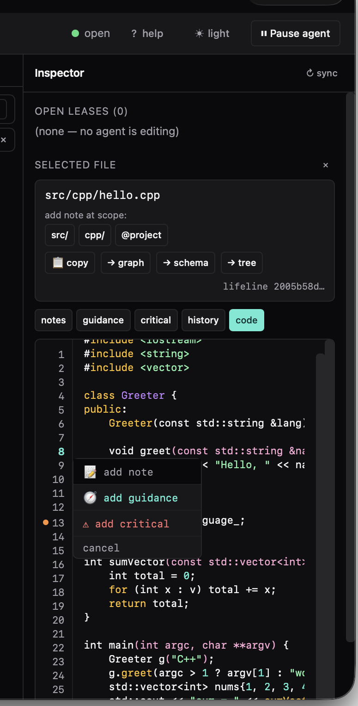
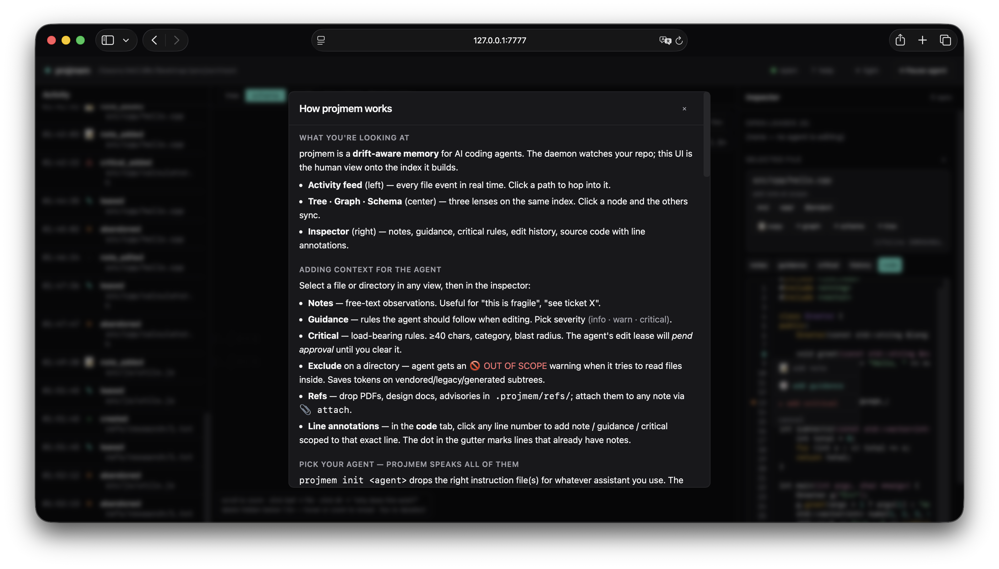
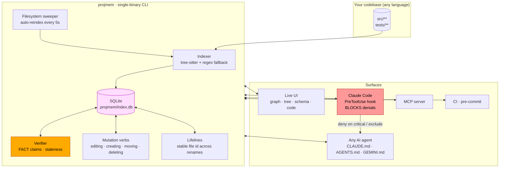

<div align="center">

# `projmem`

### Drift-aware code memory for AI agents — when the code changes, your saved beliefs are flagged refuted *before* you ship.

Persistent, machine-verified memory for AI coding agents. Saved facts flip to `refuted` the moment the cited code drifts; tool calls against user-guarded paths are refused at the boundary, not the prompt.

[](./LICENSE)
[](./tests)
[](#install)

</div>

---

## Start every prompt with `pj:`

That's the entire conversational protocol. Begin a message to Claude / Codex / Gemini / Cursor / Continue with `pj:` and the agent's first tool call **must** be `projmem context` or `projmem editing`, not Edit / Read / Bash. Warnings (`OUT OF SCOPE`, `CRITICAL`) halt the agent at the planning stage so the user sees them before any code moves.

```
You:    pj: delete tests/fixtures/sample_project/cli/main.py
Agent:  → runs projmem context first
        → sees CRITICAL: "never delete this file — load-bearing reducer"
        → halts and asks
```

The `pj:` rule is baked into every `projmem init <agent>` template — once you've run it, the agent picks it up on every new session, no reminder needed.

---

## Why this exists

Every AI coding tool today has the same failure mode:

1. The agent investigates code, builds beliefs, ships an answer.
2. The code drifts — a teammate renames a function, a refactor moves a class, you delete a file.
3. The agent's saved memory still says the **old** thing.
4. Next session, the agent reads the stale belief, treats it as ground truth, and ships a wrong answer on top of a refuted premise.

Worse: even when you write down `do not delete this file` or `this directory is out of scope`, the agent ignores your CLAUDE.md / AGENTS.md and `rm -rf`'s the file anyway. Prompts don't enforce.

**`projmem` is the missing layer.** It does four things:

| | What you get |
|---|---|
| **Verifier** | Every belief you (or the agent) save is a machine-checkable claim. On every read, projmem re-validates it against the live index. Stale claims flip to `contradicted`. |
| **Refs & history** | Attach PDFs, papers, design docs, advisories, plain-text rationale — to any file, directory, or graph node. The agent reads them as part of its planning context. **Even when a file is deleted, its lifeline keeps every event, every note, every attached ref** — so "what did this module do, and why did we remove it?" is always answerable. |
| **Lifelines** | Files keep one stable id across renames / moves / deletes, so your notes don't fall off. Deleted files become ghost lifelines whose history you can still query. |
| **Enforcement** | A Claude Code `PreToolUse` hook actually **refuses** tool calls (Edit / Write / `rm` / `cat` / `projmem symbol --file …`) against paths the user marked critical or out-of-scope. Hallucination can't bypass it. |

---

## For vibe-coders

> If you're not deeply technical but you ship code through AI agents (Claude Code, Cursor, Codex CLI, Gemini, …), this is the part for you.

You've felt all of these, probably more than once:

- The agent **forgets** what you told it last week. You re-explain "the auth flow handles JWTs, the cookie is httpOnly, don't add localStorage" every session.
- The agent **fabricates**. It writes code that calls a function that doesn't exist, references a flag you removed, or imports a module that was renamed.
- The agent **deletes a file you said don't touch.** You wrote `do not delete this` in CLAUDE.md. The agent ran `rm -rf` anyway.
- The agent **reads a vendored / generated / out-of-scope directory** and burns 30k tokens on irrelevant code.
- A change you made yesterday becomes invisible to the agent today, because nothing connects the dots.

`projmem` is the layer that fixes all five at once. It is **the agent's external memory plus its guardrails**, sitting between your AI and your codebase. It remembers what you decided, verifies that what it remembered is still true, and **refuses tool calls** that violate your rules.

Concretely, here's the experience after running `projmem init claude` (or `codex` / `gemini` / `cursor` / whatever you use):

1. You type `pj: add a /healthz endpoint` to your agent.
2. The agent reads projmem first, sees your existing notes about the routing module, your guidance ("we always add health endpoints in `src/routes/admin.py`"), and any critical rules.
3. It writes the code. As it goes, every Edit / Write / `rm` / `cat` is checked against projmem. If you've marked a file as "don't touch" — the tool call is **refused, not advised**.
4. When you start a new session next week, it remembers everything: your notes, the critical rules, the directories you said are out of scope, the line-scoped advisories you pinned to specific functions.

You don't have to memorize any commands. You install once, pick your agent, and from then on the protocol is two characters: **start your prompt with `pj:`**. The agent does the rest.

---

## Attach the docs the AI is missing (the second superpower)

Half of agent hallucinations are *information* gaps, not reasoning gaps. The model would have been right if it had read the RFC, the security advisory, the paper, the internal design doc, the migration runbook. With `projmem` you drop those files into `.projmem/refs/` and **attach them to the exact node they belong to** — a specific file, a directory, a graph node, even a single line.

What you can attach:

- **PDFs** — papers, RFCs, security advisories, vendor whitepapers, compliance docs.
- **Plain text & markdown** — design notes, migration runbooks, post-mortems, ticket links.
- **External URLs** — your own ADRs, Notion pages, internal wiki, GitHub issues.

How it shows up:

1. Drop a file in `.projmem/refs/` (e.g. `.projmem/refs/auth-token-incident-2025.pdf`).
2. In the live UI, click the file / directory / node → **📎 attach** → pick the ref → write a note that links to it.
3. From then on, every time the agent runs `projmem editing` on a path that scope, **the ref appears in the response** with a clickable link. The agent reads the rationale before touching code.

Combined with lifelines: **deleted files don't lose their attached refs.** A ghost lifeline keeps every event, every note, every link to its supporting docs — so six months later you can still answer "why did we remove this module, and what advisory drove the decision?".

This is the layer SCIP, LSIF, ctags, and every prior "agent memory" tool skip. They store symbols and text. `projmem` stores **the supporting evidence behind every decision**, attached to the exact part of the codebase it justifies, and re-validated on every read.

---

## The loop, visualized



---

## Install

Requirements: **Python 3.9+** and **`pip`**. That's it. No Node, no Docker, no cloud account.

```bash
git clone https://github.com/m4ll0k/projmem.git
cd projmem
pip install -e '.[treesitter,daemon]'
```

Extras are additive — pick what you need:

| Extra | What it adds | When you need it |
|---|---|---|
| `[treesitter]` | Multi-language AST indexing (Python, JS/TS, Go, Rust, Java, C/C++, Ruby, Kotlin, Swift, PHP, Scala) | Always — without it, only Python is AST-grounded |
| `[daemon]`     | FastAPI daemon + live UI (`projmem ui`) | If you want the browser-based UI |
| `[mcp]`        | MCP server (`projmem mcp-server`) | Cursor / Claude Desktop / Continue |
| `[yaml]`       | YAML config support | If you prefer `.projmem/config.yaml` |
| `[test]`       | pytest + dev deps | Contributors |

Verify the install:

```bash
projmem --help
python3 -m pytest -q          # 752 tests should pass
```

If the test run is green and `projmem --help` prints a subcommand list, you're done. Move on to **Quick start** below.

---

## Quick start — choose your agent

projmem ships instruction files for every major coding assistant. Pick the flag for yours:

```bash
cd path/to/your/repo

# Fresh project ─────────────────────────────────────────────
projmem init claude        # or: codex / gemini / cursor / copilot / aider / opencode / all / auto
projmem index
projmem ui --port 7777     # opens the live UI in your browser

# Existing project ──────────────────────────────────────────
projmem init claude --reindex
projmem ui --port 7777

# Switching / multi-agent ───────────────────────────────────
projmem init all --force   # drops CLAUDE.md + AGENTS.md + GEMINI.md + .cursorrules + …
```

| `init` flag | drops | for |
|---|---|---|
| `claude` | `CLAUDE.md` | Claude Code · Anthropic API · MCP |
| `codex` | `AGENTS.md` | OpenAI Codex CLI |
| `gemini` | `GEMINI.md` | Gemini CLI · Code Assist |
| `cursor` | `.cursorrules` | Cursor editor |
| `copilot` | `.github/copilot-instructions.md` | GitHub Copilot |
| `aider` | `AGENTS.md` | aider · droid · trae · hermes · openclaw |
| `opencode` | `opencode.md` | OpenCode |
| `antigravity` | `antigravity.md` | Antigravity |
| `kiro` | `.kiro/steering/` | Kiro |
| `all` | every file above | multi-agent setup |
| `auto` | picks from env vars | default if you omit the flag |

Then tell your agent something like: `pj: add a /healthz endpoint`. The `pj:` prefix is the conversational protocol baked into every instruction file — the agent's first tool call must be `projmem context` or `projmem editing`, not Edit/Read/Bash.

---

## Screenshots

<div align="center">



*The live UI: activity feed on the left, tree/graph/schema in the center, inspector on the right.*

<br/><br/>

<table>
<tr>
<td width="50%"><br/><em>Force-directed graph with directory clustering</em></td>
<td width="50%"><br/><em>Code tab — click a gutter line number to add note · guidance · critical</em></td>
</tr>
<tr>
<td><br/><em>Notes tab with line-scoped badges and staleness indicators</em></td>
<td><br/><em>First-run help popup explains every section</em></td>
</tr>
</table>

</div>

---

## How it works



- **Local-first**: SQLite + tree-sitter. No cloud, no LLM in the verifier hot path.
- **Polyglot**: Python (stdlib AST), JS/TS (tree-sitter), Go / Rust / Java / C / C++ / Ruby / Kotlin / Swift / PHP / Scala via tree-sitter; everything else via regex fallback.
- **Concurrent-safe**: SQLite WAL + busy_timeout; the daemon serves the UI while CLI commands write.

---

## Schema

The five tables that carry the v2 semantics:

| Table | Purpose |
|---|---|
| `files` | Every indexed path with its hash, language, mtime, and current `lifeline_id`. |
| `file_lifeline` | One row per logical file across its whole life — created at, current path (NULL when tombstoned). |
| `file_event` | Append-only history per lifeline: `created · leased · edited · released · abandoned · moved · deleted`, plus the reason from each mutation verb. |
| `edit_lease` | Open and historical leases. State machine: `open → pending_approval → open → done | abandoned`. |
| `annotations` | Every note, guidance, constraint, preference, critical, exclude, skill — including `cited_line`, `severity`, `category`, `blast_radius_hops`, and `staleness` from the verifier. |

Schema migrations live in `projmem/migrations/m00*.py` and run on first connect.

---

## The seven verbs that matter (v1)

projmem ships 60+ subcommands, but in practice agents only ever use seven:

| Verb | Calls (36 runs) | What it does |
|---|---:|---|
| `projmem note add <target> "<prose>"` | 47× | Save a finding. Auto-extracts FACT claims from prose. |
| `projmem notes` | 43× | Project-wide summary; surfaces `contradicted_count`. |
| `projmem session <target>` | 12× | Per-target bootstrap: notes + neighbors + freshness. |
| `projmem conclude "<text>"` | 10× | One-line conclusion; parses inline `@predicate(...)`. |
| `projmem fact-check "<draft>"` | 7× | Verify claims in your draft before shipping. |
| `projmem task` | 2× | Session continuity (start / step / blocked / resume / close). |
| `projmem refresh` | 2× | Incremental reindex. |

---

## The five mutation verbs (v2 — what the hook enforces)

```bash
projmem editing  <path> --reason "..."         # before Edit / Write / Read
projmem creating <path> --reason "..."         # before creating a new file
projmem moving   <old> <new> --reason "..."    # before rename / move
projmem deleting <path> --reason "..."         # before delete
projmem done     <lease_id>                    # after successful change
```

Every call appends to `file_event`. Reasons must be ≥ 20 chars and contain a verb + object.

---

## Enforcement — three stacked layers

Prompts don't enforce, so projmem doesn't rely on them.

**Layer 1 — the `pj:` convention** (in every instruction template): when the user begins a message with `pj:`, the agent's **first tool call must be `projmem context` or `projmem editing`**, not Edit / Read / Bash. Warnings (OUT OF SCOPE, CRITICAL) halt the agent at the planning stage.

**Layer 2 — Claude Code PreToolUse hook** (install once):

```bash
projmem hook install --claude-code
```

The hook intercepts every Edit / Write / Read / Bash tool call. On `rm`/`mv` against a critical or excluded path, or `cat`/`grep`/`projmem symbol --file …` against an excluded path, it returns `permissionDecision: "deny"` with the user's reason surfaced verbatim. The agent can't bypass it.

**Layer 3 — CLI advisory** (for agents without hooks — Codex / Gemini / plain API): `projmem symbol`, `projmem at`, `projmem pack`, `projmem reverse` all emit `exclusion_warnings[]` in their JSON output when the target is under an exclusion.

---

## Live UI

```bash
projmem ui --port 7777
```

Three panes:

- **Activity feed** (left) — every file event in real time. Click any path to hop.
- **Tree · Graph · Schema** (center) — three lenses on the same index, cross-view selection sync.
- **Inspector** (right) — notes, guidance, critical, code with line-precise annotation menu (click a gutter line number to add note/guidance/critical scoped to that line).

The daemon auto-syncs disk every 5s — files written by `projmem init`, your agent's write_file tool, or anything else outside `projmem creating` are indexed and broadcast as live events. Disable with `--no-watch`.

UI is also where you approve pending-approval leases (a critical rule blocked an edit; click Approve to unblock).

---

## Limits — known and intentional

- **Local only.** No cloud sync. Two operators on the same repo work from separate `.projmem/` dirs unless they commit them (and the indexer is deterministic enough that committing the DB is sometimes useful).
- **Indexer is best-effort on regex fallback languages.** AST-grounded for Python, JS/TS, Go, Rust, Java, C/C++; everything else is regex. Surfaces this honestly in the `coverage` field.
- **Hook enforcement is Claude-Code-specific.** Codex / Gemini / plain API agents only get the advisory CLI warnings + the `pj:` convention. The `permissionDecision: "deny"` mechanism only exists in Claude Code's hook protocol.
- **Daemon listens on `127.0.0.1` only.** Refuses non-loopback binds. No remote access; tunnel through SSH if you want it.
- **Filesystem sweeper runs the indexer on a 5s timer.** Big repos (>50k files) may want `--watch-interval 30` to dial it down.
- **No conflict resolution if two operators edit annotations at once.** Last-write-wins on the SQLite row.
- **No PyPI package yet.** Editable install from clone (`pip install -e .`) is the only path today; PyPI publish is planned.

---

## Comparison vs alternatives

| | scratchpad / `notes.md` | Cursor / Continue memory | LSP servers | **`projmem`** |
|---|:---:|:---:|:---:|:---:|
| Survives across sessions | ✓ | ✓ | — | ✓ |
| Verifies beliefs against code | ✗ | ✗ | partial (live only) | **✓** |
| Drift detection (REFUTED signal) | ✗ | ✗ | — | **✓** |
| Refuses tool calls on guarded paths | ✗ | ✗ | — | **✓** |
| Local, single-binary CLI | ✓ | ✗ | — | ✓ |
| Works with any LLM agent | ✓ | per-IDE | per-IDE | ✓ |
| MCP server included | — | — | — | ✓ |
| CI / pre-commit gate | — | — | — | ✓ |

---

## Status

- ✓ **752 tests passing**
- ✓ Live UI (`projmem ui`) with graph · tree · schema · code · activity feed
- ✓ Claude Code PreToolUse hook with hard-deny on critical / exclude
- ✓ Filesystem auto-sweeper (default on)
- ✓ Lifelines + tombstones across renames/deletes
- ✓ MCP server for Cursor / Claude Desktop / Continue
- 🚧 PyPI publish — planned
- 🚧 LSP shim (editor diagnostics) — planned

---

## Documentation

| File | What's in it |
|---|---|
| [`USAGE.md`](./USAGE.md) | Full command reference, every flag, every workflow |
| [`docs/DESIGN.md`](./docs/DESIGN.md) | MVP design note — what we built and why |
| [`docs/v2-design.md`](./docs/v2-design.md) | v2 lifelines, leases, mutation verbs, UI, hooks |
| [`docs/claims.md`](./docs/claims.md) | Verifier deep-dive — predicates, truth classes, staleness |
| [`docs/agent-integration.md`](./docs/agent-integration.md) | Wiring projmem into specific agents |
| [`docs/ECOSYSTEM.md`](./docs/ECOSYSTEM.md) | How projmem differs from SCIP / LSIF / Semgrep / CodeQL |

---

## License

[**PolyForm Noncommercial 1.0.0**](./LICENSE) — free for personal, research, educational, and other noncommercial use. **Commercial use requires a separate license from the author.**

Plain-English: do whatever you want with it for personal projects, research, study, hobby work, or inside a charity / school / public agency. For a commercial product, SaaS, paid consulting, or paid developer tool — talk to me first ([`CITATION.cff`](./CITATION.cff)).

## Contributing

See [`CONTRIBUTING.md`](./CONTRIBUTING.md). Issues + PRs welcome.

## Security

Vulnerability reports: see [`SECURITY.md`](./SECURITY.md). Please do **not** open a public issue for security findings.

---

<div align="center">

**If projmem stops one wrong answer from shipping, it's earned its keep.**

⭐ Star the repo if this is the agent-memory layer you wish you had last week.

</div>
