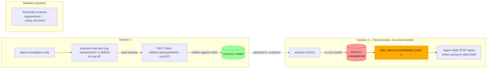
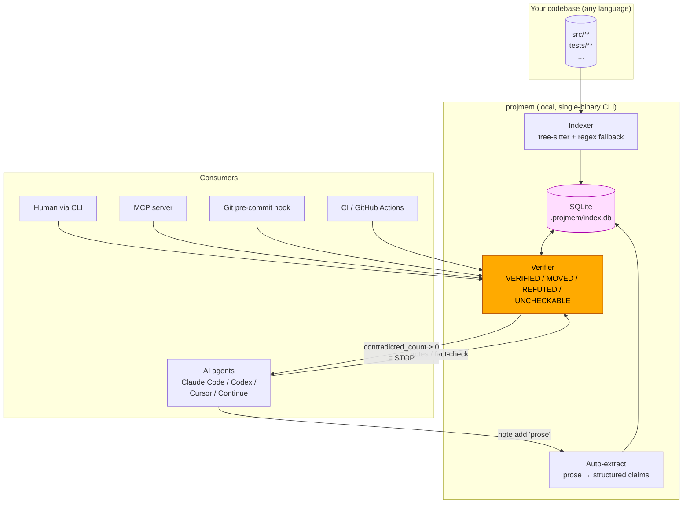

<div align="center">

# `projmem`

### drift-aware code memory for AI agents

> **grep tells you what's in the code.
> projmem tells you whether what you believed about the code is still true.**

[](./LICENSE)
[](./tests)
[](#install)
[](./bench/multisession/REAL_RESULTS.md)

</div>

---

## 60-second elevator pitch

Every AI coding tool today has the same failure mode:

1. The agent investigates code, builds beliefs, ships an answer.
2. The code drifts. (Teammate renames a function. Refactor moves a class. You delete a file.)
3. The agent's saved memory still says the OLD thing.
4. Next session, the agent reads the stale belief, treats it as ground truth, and ships a wrong answer on top of a refuted premise.

**`projmem` is the missing layer.** Every belief you save (or your agent saves) is a structured, machine-checkable claim — `defined-at(setupmethod, src/foo.py:42)`, `exported-from(handler, lib/bar.ts)`, `env-read-at(DATABASE_URL, src/config.py:15)`. On every read, projmem re-validates each claim against the current index. If `setupmethod` moved or got renamed, the claim flips to `REFUTED` and the project's `contradicted_count` increments — your CI gate fires, your agent reads the blocker signal, and the wrong answer is stopped at the door.

**The differentiator vs every other "agent memory" tool**: nothing else verifies. They store text. projmem stores claims and re-checks them.

---

## The loop, visualized



Every saved belief survives the session boundary AND gets automatically re-checked. The `contradicted` flag is the entire product.

---

## Real benchmark numbers (not vibes)

Two independent test results across **57 agent runs** with `claude-sonnet-4-6`. Methodology + raw transcripts in [`bench/multisession/REAL_RESULTS.md`](./bench/multisession/REAL_RESULTS.md).

### Test 1 — controlled benchmark (N=7 reps × 3 arms, ysoserial)

| | Baseline (no memory) | **`projmem`** | Free-form `notes.md` |
|---|---:|---:|---:|
| Correctness (session-2)             | 0/7 (truthful NO_RECORD) | **7/7** | 7/7 |
| Mean tokens / session-2             | 1330 | **1051** | 1688 |
| **Token cost vs `notes.md`**        | — | **−38%** | baseline |
| Variance across reps                 | wide | **tight (1039–1065)** | wide (1548–1894) |

projmem ties scratchpad on **correctness** but uses **38% fewer tokens** — the agent reads pre-computed `staleness: contradicted` from `projmem notes` once, instead of re-investigating each finding manually.

### Test 2 — in-the-wild (Codex builds, Claude audits a fresh codebase)

A different LLM (Codex) built a fresh FastAPI/SQLAlchemy app (`tasktrak`, ~1100 LOC) — no chance of training-data leakage to the auditor. Then Claude Sonnet audited it across two sessions: identified 5 specific symbols, then re-verified after the operator renamed two functions, deleted one file, and moved a third symbol.

| | Baseline (no memory) | **`projmem`** |
|---|---:|---:|
| Session-2 verdicts correct | 0/5 (truthful NO_RECORD) | **5/5** ✓ |
| Verifiable answers / dollar | 0 | **30** |

The decisive transcript (projmem session 2):

> *"The five session-1 findings (notes 6-10) map directly. Based on staleness:*
> *— Note 6: `complete_task` @ task_service.py:42 — **contradicted***
> *— Note 7: `verify_password` @ auth_service.py:16 — **contradicted***
> *— Note 8: `Task` @ task.py:17 — fresh*
> *— Note 9: `TaskStatus` @ task.py:10 — fresh*
> *— Note 10: `legacy_list_tasks` @ legacy.py:17 — **contradicted**"*

The agent ran `projmem notes` once, READ the per-note staleness, and answered. **No file investigation.** That's what the verifier buys.

---

## Why projmem exists

Every other "agent memory" approach hits one of three walls:

| Failure mode | What today's tools do | What projmem does |
|---|---|---|
| **Agent forgets across sessions** | Each new session starts cold, re-investigates everything (wastes tokens) or fabricates confidently (ships wrong answers) | `.projmem/` survives across sessions; `task resume` shows what session N-1 was doing |
| **Notes go stale invisibly** | Free-form `notes.md` / Cursor / Continue / IDE memory all store TEXT; nothing re-validates that text against current code | Every saved claim has a structured shape; verifier re-checks against the live index on every read |
| **No blocker signal when prior beliefs become wrong** | Agents read stale text as ground truth and build the next decision on a refuted premise | `contradicted_count > 0` is a hard STOP signal; CI gates and agent prompts both respect it |

Indexers (SCIP, LSIF, ctags) give you *symbols*. Analyzers (Semgrep, CodeQL) give you *patterns*. LLM scratchpads give you *text*. **None of them give you "the thing I saved last week is no longer true and here's what changed."** That sentence is the entire product.

---

## How it works (architecture)



- **Local-first**: SQLite + tree-sitter, no daemon, no cloud, no LLM in the verifier hot path.
- **Polyglot**: Python (stdlib AST), JS/TS (tree-sitter), Go/Rust/Java/C/C++/Ruby/Kotlin/Swift/PHP/Scala via tree-sitter; everything else via regex fallback.
- **Surfaces every consumer needs**: CLI for humans + scripts, MCP server for agent runtimes, pre-commit hook generator, JSON output for CI gates.

---

## Install

```bash
git clone https://github.com/m4ll0k/projmem.git
cd projmem
pip install -e '.[treesitter]'    # treesitter extra is strongly recommended
```

Verify:

```bash
python3 -m pytest tests/ -q       # 629 tests should pass
projmem --help
```

Optional extras:

| Extra | What it adds | When you need it |
|---|---|---|
| `[treesitter]` | Multi-language AST indexing | Always — without it only Python is AST-grounded |
| `[mcp]`        | MCP server (`projmem mcp-server`) | Cursor / Claude Desktop / Continue integrations |
| `[yaml]`       | YAML config support | If you use `.projmem/config.yaml` |
| `[test]`       | pytest + dev deps | Contributors |

---

## Quickstart — 5 minutes from clone to verified claim

```bash
cd /path/to/your/repo
projmem init claude     # one-shot: index + drop CLAUDE.md/AGENTS.md
```

**Save a finding as PROSE.** projmem auto-extracts a structured FACT claim — no JSON syntax, no `@predicate(...)` notation, just write a sentence with backticks around the symbol name and `file:line` after "defined at":

```bash
projmem note add src/compiler/sys.ts --kind note \
  "\`TSC_WATCHFILE\` is defined at src/compiler/sys.ts:1516"
```

projmem's response confirms the auto-extracted claim:

```json
{
  "id": 1,
  "auto_extracted_claims": [{
    "subject": "TSC_WATCHFILE",
    "predicate": "defined-at",
    "object": "src/compiler/sys.ts:1516",
    "truth_class": "FACT",
    "status": "VERIFIED"
  }],
  "staleness": "fresh"
}
```

**Now break the claim** — rename the symbol:

```bash
sed -i '' 's/TSC_WATCHFILE/TSC_WATCH_FILE/' src/compiler/sys.ts
projmem refresh    # incremental reindex; auto-applies by default
projmem notes
```

projmem now reports:

```json
{
  "totals": {
    "total_notes": 1,
    "by_staleness": { "contradicted": 1 }
  },
  "repo_memory": {
    "contradicted_count": 1,
    "hint": "1 note(s) currently contradicted — prior FACT claims refuted. STOP."
  }
}
```

The saved note's `staleness` flipped from `fresh` → `contradicted`. Your CI gate (`projmem complete || exit 2`), your agent's session-start check, your editor's status bar — all see this signal.

That's the entire workflow.

---

## The seven verbs that matter

`projmem` ships with 60+ subcommands (`projmem usage` for the full catalog), but **real benchmark data showed an LLM agent only ever uses seven of them**. Real, measurable usage across 36 multi-session benchmark runs:

| Verb | Calls | What it does |
|---|---:|---|
| `projmem note add <target> "<prose>"` | 47× | Save a finding (auto-extracts FACT claims from prose) |
| `projmem notes`                       | 43× | Project-wide summary, surfaces `contradicted_count` blocker |
| `projmem session <target>`            | 12× | Per-target bootstrap (notes + neighbors + freshness) |
| `projmem conclude "<text>"`           | 10× | Save a one-line conclusion (parses inline `@predicate(...)`) |
| `projmem fact-check "<draft>"`        |  7× | Verify claims in your draft text BEFORE shipping (exit 2 on REFUTED) |
| `projmem task`                        |  2× | Session-continuity (start / step / blocked / resume / close) |
| `projmem refresh`                     |  2× | Incremental reindex after edits (auto-applies) |

Run bare `projmem` to see this list at any time. The 60+ "expert" verbs (graph rendering, contract diffs, snapshot management, MCP server, hook installer, etc.) are still there for power users — `projmem usage --json` is the full machine-readable catalog.

---

## Four claim verdicts (the verifier's vocabulary)

| Verdict | Meaning | Exit code |
|---|---|---:|
| **VERIFIED**    | Claim matches the indexed code at the cited location.        | 0 |
| **MOVED**       | Symbol still in the cited file, but at a different line. (Soft warning; carries `moved_to` so you can re-cite without re-investigating.) | 0 |
| **REFUTED**     | Symbol absent or in a different file. Wrong claim. **Note flips to `staleness: contradicted`.** | 2 |
| **UNCHECKABLE** | Predicate isn't in the catalog (`projmem predicates`).        | 0 |

Strict CI gate: `refuted_count == 0 AND moved_count == 0`. Loose gate (the default): `refuted_count == 0`.

Six predicates currently supported (extensible): `defined-at`, `exported-from`, `env-read-at`, `flag-read-at`, `reexported-via`, `reverse-dependency-of`.

---

## Real-world use cases

### 1. Pre-commit hook (catch staleness before you commit)

```bash
projmem hook install      # writes .git/hooks/pre-commit
git commit -m "refactor"
# → hook runs `projmem refresh && projmem complete`
# → if any saved FACT claim is now REFUTED, commit is BLOCKED
```

### 2. CI gate (catch staleness before the PR merges)

```yaml
# .github/workflows/projmem.yml
- name: Verify saved beliefs against current code
  run: |
    pip install -e '.[treesitter]' projmem
    projmem index
    projmem complete || exit 2     # exit 2 on any HIGH finding
```

### 3. MCP integration (every agent that supports MCP gets projmem for free)

Add to your client's MCP config (Claude Desktop / Cursor / Continue):

```json
{
  "projmem": {
    "command": "projmem",
    "args": ["mcp-server", "--path", "/abs/path/to/your/repo"]
  }
}
```

Tools exposed: `session`, `search`, `symbol`, `reverse`, `forward`, `fact-check`, `notes`, `note_add`. The agent picks them up automatically — no CLI subprocess overhead.

### 4. Multi-session investigation

```bash
# Day 1 — start a long task
projmem task start "audit auth flow for token-leak"
projmem note add src/auth/jwt.py "\`verify_token\` is defined at src/auth/jwt.py:42"
projmem note add src/auth/middleware.py "\`require_user\` is defined at src/auth/middleware.py:18"

# Day 2 (or next agent session) — pick up where you left off
projmem task resume    # shows your open task + steps + saved notes
projmem notes          # shows what you found, AND whether any belief is now contradicted
```

---

## Comparison vs alternatives

| | `notes.md` / scratchpad | Cursor / Continue memory | LSP servers (gopls, pyright) | **`projmem`** |
|---|:---:|:---:|:---:|:---:|
| Survives across sessions             | ✓ | ✓ | — | ✓ |
| Verifies saved beliefs against code  | ✗ | ✗ | partial (live only) | **✓** |
| Drift detection (REFUTED signal)     | ✗ | ✗ | — | **✓** |
| Local, single-binary CLI             | ✓ | ✗ | — | ✓ |
| Works with any LLM agent             | ✓ | per-IDE | per-IDE | ✓ |
| Structured claim catalog             | ✗ | ✗ | — | ✓ |
| MCP server included                  | — | — | — | ✓ |
| CI / pre-commit gate                 | — | — | — | ✓ |
| **Token cost on multi-session work** | baseline | n/a | n/a | **−38%** |

`projmem` is the only entry in this matrix that combines persistent memory + automatic re-validation + cross-agent / cross-IDE portability + a CI-gateable signal.

---

## Status

- ✓ **629 tests passing**
- ✓ **Two real-LLM benchmarks** (controlled + in-the-wild — see `bench/multisession/REAL_RESULTS.md`)
- ✓ **MCP server** (`projmem mcp-server`) for Cursor / Claude Desktop / Continue / any MCP-aware client
- ✓ **Trace-replay primitive** — re-grade old benchmark runs with new judges for $0
- ✓ **60+ commands** beyond the seven core ones; see `projmem usage --json` for the full catalog
- 🚧 LSP shim (publishes `contradicted` notes as editor diagnostics — red squiggles in VSCode/Zed/Cursor) — planned
- 🚧 Live blast-radius graph (browser tab, agent edits → graph flashes red on the affected nodes) — planned

---

## Roadmap

| Item | Status | Notes |
|---|---|---|
| Auto-extract claims from prose       | ✅ shipped | Write `\`X\` is defined at file:line`; structured FACT claim is created automatically |
| `note add` immediate verdict preview | ✅ shipped | Response carries `auto_extracted_claims[i].status` so you see VERIFIED/MOVED/REFUTED at write time |
| MCP server                            | ✅ shipped | `projmem mcp-server`; works with Cursor / Claude Desktop / Continue |
| LSP server (editor diagnostics)       | planned   | Tiny shim publishes `contradicted` notes as red squiggles in VSCode / Zed / Cursor |
| Continuous file-watcher daemon        | planned   | `projmem watch` exists; making it default for always-current state |
| Live blast-radius graph (browser)     | planned   | File-watch + websocket → graph flashes red on affected importers |
| PyPI package                          | planned   | Today: `pip install -e .` from clone. Soon: `pip install projmem` |
| Codex driver in benchmark harness     | planned   | Currently Claude-only on the bench; Codex driver wired but unrun |
| `note_add` MCP tool with prose form   | planned   | MCP currently exposes `note_add` with structured args; should accept prose too |

---

## Documentation

| File | What's in it |
|---|---|
| [`docs/USAGE.md`](./docs/USAGE.md)              | Full command catalog, every flag explained |
| [`docs/DESIGN.md`](./docs/DESIGN.md)            | The MVP design note — what we built and why |
| [`docs/claims.md`](./docs/claims.md)            | The verifier deep-dive — predicates, truth classes, staleness model |
| [`docs/agent-integration.md`](./docs/agent-integration.md) | How to wire projmem into Claude Code / Codex / Cursor / any LLM |
| [`docs/ECOSYSTEM.md`](./docs/ECOSYSTEM.md)      | How projmem differs from SCIP / LSIF / Semgrep / CodeQL |
| [`bench/multisession/REAL_RESULTS.md`](./bench/multisession/REAL_RESULTS.md) | Full benchmark methodology + raw numbers |

---

## License

[**PolyForm Noncommercial 1.0.0**](./LICENSE) — free for personal, research, educational, and other noncommercial use. **Commercial use requires a separate license from the author.** Open an issue or contact via the address in [`CITATION.cff`](./CITATION.cff) for commercial inquiries.

Plain-English version: do whatever you want with it for personal projects, research, study, hobby work, or inside a charity / school / public agency. If you want to use it for a commercial product, SaaS, paid consulting, or a paid developer tool — talk to me first.

## Contributing

See [`CONTRIBUTING.md`](./CONTRIBUTING.md). Issues + PRs welcome. The codebase is small and opinionated; please read through before opening a PR.

## Citation

If you use projmem in research, see [`CITATION.cff`](./CITATION.cff).

## Security

Vulnerability reports: see [`SECURITY.md`](./SECURITY.md). Please do **not** open a public issue for security findings.

---

<div align="center">

**If projmem stops one wrong answer from shipping, it's earned its keep.**

⭐ Star the repo if this is the agent-memory layer you wish you had last week.

</div>
